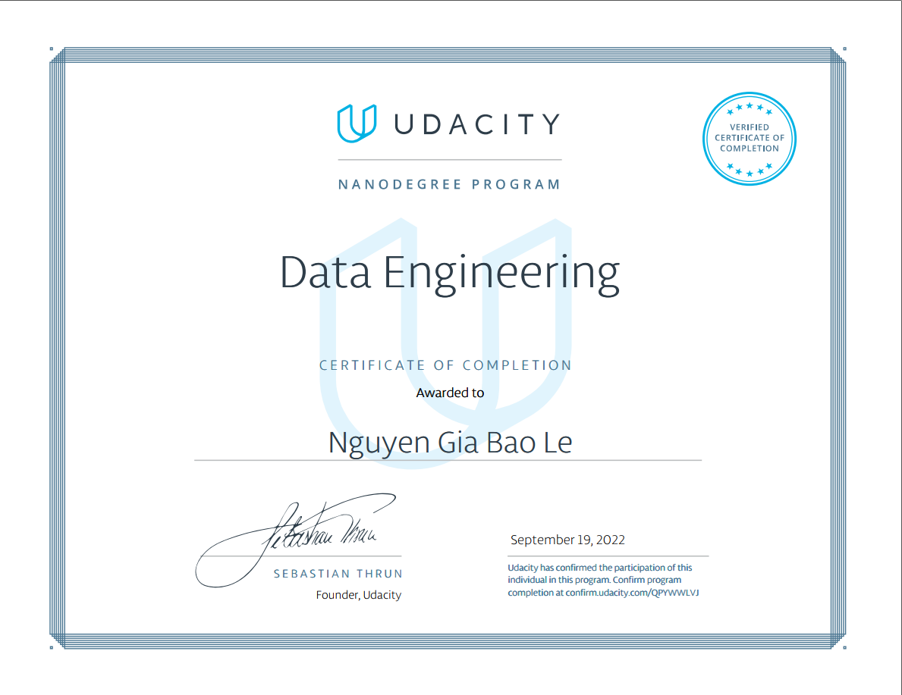

# data_engineer_course_udacity

##  GET_PASSES_THIS_REPO_UDACITY_PLEASE

The Data Engineer Nanodegree Course from Udacity

The structure of course:
- Data Modeling: learn to create relational and NoSQL data models to fit the diverse needs of data consumers. Use ETL to build databases in PostgreSQL and Apache Cassandra
- Cloud Data Warehouses: learn to create cloud-based data warehouses. Sharpen your data warehousing skills, deepen understanding of data infrastructure, and using Amazon Web Services (AWS).
- Spark and Data Lakes: learn about the big data ecosystem and how to use Spark to work with massive datasets, also how to store big data in data lake and queryy it with Spark
- Automate Data Pipelines: learn to schedule, automate, and monitor data pipelines using Apache Airflow, also run data quaility checks, track data lineage adn wotk with data pipelines in production
- Capstone Project: define the scope of project and demonstrate what I have learn in this Data Engineer Nanodegree Course

